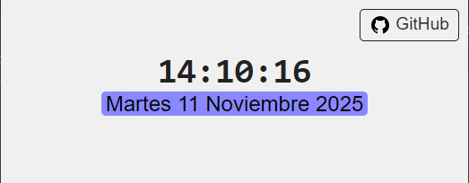

# Reloj y Fecha

Componente web minimalista que muestra la hora actual y la fecha en español.



## Características

- Reloj digital en tiempo real (formato 24h).
- Fecha completa en español (día, número, mes, año).
- Actualización automática cada segundo.
- Diseño limpio, milimalista, funcional.
- Sin dependencias externas.

## Estructura

```
├── index.html           # Estructura HTML
├── dateandclock.css     # Estilos
└── dateandclock.js      # Lógica del reloj
```

## Uso

Simplemente abre `index.html` en tu navegador. El reloj comenzará automáticamente.

## Tecnologías

- HTML5
- CSS3
- JavaScript vanilla

## Personalización

### Cambiar colores

En `dateandclock.css`:
```css
#clock {
  color: #222222;  /* Color del reloj */
}

#date {
  color: #555555;  /* Color de la fecha */
}

.date-display mark {
  background-color: #ffe600;  /* Fondo de la fecha */
}
```